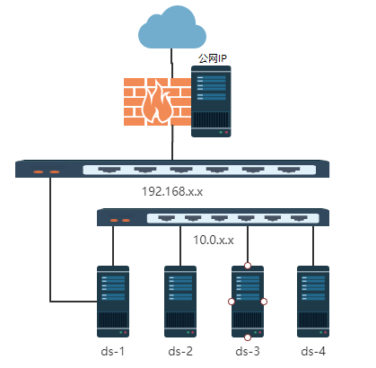
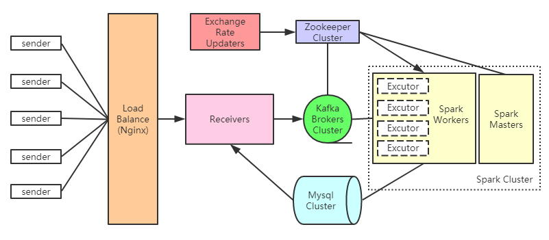

# Distributed System Lab - Distributed Transaction Settlement System
## 1 Design
### 1.1 Overview

本次 Lab 我们实现了一个分布式业务处理系统。

国际化商家出售多种商品，每种商品的价格使用的货币有所不同。而客户可以提交订单购买多种商品，并使用某一种货币来支付。我们的系统可以接受这种订单并换算货币得出客户以自己的货币应付的款额。

整个系统的各个模块可部署在不同的机器上，通过网络组成了分布式系统。并且所有模块都以一定程度的高可用形式来实现和部署。

各个模块的功能大致如下：

- Sender 模拟客户发送新订单
- Receiver 接受用户订单并将新订单通过 Kafka 集群传递给 Paying Calculator；还接受查询请求，从 Mysql 中将订单处理结果和成交总额取出并返回
- Exchange rate updater 每分钟更新汇率到 Zookeeper 中
- Paying alculator 从 Zookeeper 获取最新汇率并计算新订单应付款，将结果存入 Mysql

### 1.2 Data structures

- 新订单(json, 用于传输)

   |Field|Description|
   |--|--|
   |`user_id` _string_|用户ID|
   |`initiator` _string_|用户使用的货币, 可以是 `RMB`, `USD`, `JPY`, `EUR`|
   |`time` _int_|发送订单的时间戳|
   |`items` _[]_|货物列表|
   |`items[].id` _int_|货物ID|
   |`items[].number` _int_|货物数量|

- 商品(sql, 存储在mysql中)

   |Field|Description|
   |--|--|
   |`id` _int(10) unsigned_|ID|
   |`name` _varchar(200)_|名字|
   |`price` _decimal(65,30)_|价格|
   |`currency` _varchar(100)_|价格使用的货币|
   |`inventory` _int(10) unsigned_|库存|

- 订单结果(sql, 存储在mysql中)

   |Field|Description|
   |--|--|
   |`id` _varchar(100)_|订单ID|
   |`user_id` _varchar(100)_|用户ID|
   |`initiator` _varchar(100)_|用户使用的货币|
   |`success` _tinyint(1)_|是否成功, 为null则表示处理中|
   |`paid` _decimal(65,30)_|以用户使用的货币的应付款|

- 成交额(sql, 存储在mysql中)

   |Field|Description|
   |--|--|
   |`currency` _varchar(100)_|货币|
   |`amount` _decimal(65,30)_|全期成交额总量|

- 汇率(存储在zookeeper中的/exchange_rate结点下)

   |Node|Initial value|
   |--|--|
   |/RMB|2.00|
   |/USD|12.00|
   |/JPY|0.15|
   |/EUR|9.00|

### 1.3 Sender

从文件中读取订单信息并按照约定的接口(HTTP/json)将订单发送至 Receiver

### 1.4 Receiver/HTTP server/Kafka producer

1. 从 Sender 接受新订单请求，生成订单号并将新订单放入 Kafka
2. 响应查询 amount 的请求返回指定货币的订单成交额总和

### 1.5 Exchange rate updater

随机生成汇率并将指定货币的汇率写入 Zookeeper 对应的 znode 中

### 1.6 Paying calculator/Kafka consumer/Spark driver

从 kafka 中获取新订单，并通过库存比对确定是否可以接受，对于可以接受的订单根据从 zookeeper 获得的汇率信息计算其应付款，并累算总的成交额

整个流程以Spark平台的模型实现

## 2 Architecture

### 2.1 物理架构

网络和服务器都是基于OpenStack搭建的，由课程提供的设施。

能供调整的只有实例性能和数量。

这里选择配置了 4VCPU, 8G RAM, 80G disk 的 4 个实例。

4 个实例分别命名为 `ds-1`, `ds-2`, `ds-3`, `ds-4`, 安装了 ubuntu-x86_64-16.04

### 2.2 系统架构

其中除了 nginx 的所有组件和模块，都采用了一定的冗余来实现高可用。

1. Receiver 本身实现为无状态的 HTTP 服务器，我们在不同的机器上部署了 3 个实例，用来并行处理大量订单。
2. Exchange Rate Updater 采用分布式锁进行同步，一个实例执行更新任务，其余实例备份待机。我们为每种货币部署了两个实例进行更新。
3. 我们部署了三个 Zookeeper 实例组成最小的集群。
4. 我们在每一个机器上都部署了 Kafka broker 提高读效率, 并设置每个消息的每个 partition 会至少有三个 replication 保证数据可靠。
5. Mysql 官方提供了 Group Replication 的高可用一致性方案，我们在之上搭建了 Proxysql 作为均衡负载、读写分离、缓存。同时部署了两个proxysql以防单点故障，依靠客户端connector来切换。
6. 我们在所有机器上部署了 Spark worker，又部署了 2 个 Spark master。Spark的集群模式是借助zookeeper的备份模式，和我们的exchange rate updater有些类似，一次只有一个master工作，但故障时可以方便地切换到另一个master上。至于worker本身就是故障可恢复的设计，部署4个worker只是为了性能考量。

## 3 Implement

1. [Sender](./doc/sender.md)
2. [Receiver](./doc/receiver.md)
3. [Exchange rate updater](./doc/exchange_rate_updater.md)
4. [Paying calculator](./doc/calculator.md)

## 4 Deployment

> TODO: Put here links refering to deployment/operation logs(.md files).

1. [Zookeeper Cluster](./doc/zookeeper.md)
2. [Kafka Cluster](./doc/kafka.md)
3. [Spark Cluster](./doc/spark.md)
4. [DB cluster: ProxySQL + MySQL](./doc/mysql.md)
5. [Receiver](./doc/receiver.md#部署)
6. [Exchange rate updater](./doc/exchange_rate_updater.md#部署)
7. [Paying calculator](./doc/calculator.md#部署)

## 5 Management

[项目管理](./doc/management.md)

## 6 Members & Contribution

| Student ID   | Name   | Work |
| ------------ | ------ |------|
| 5142609052   | 沈小洲 |项目规划、环境配置、Nginx和Kafka的搭建、帮助组员实现和部署各自的模块|
| 516030910313 | 宋博仪 |Spark的搭建、Paying calculator的实现|
| 516030910459 | 邵欣阳 |Zookeeper的搭建、Exchange rate updater的实现|
| 516030910460 | 汪喆昊 |Mysql的搭建、Sender和Receiver的实现|
