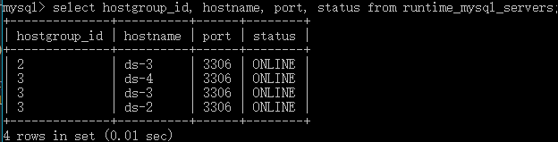

# MySQL 集群

## 任务
- 使用[MySQL Group Replication](https://dev.mysql.com/doc/refman/8.0/en/group-replication.html)在三台服务器上搭建高可用的数据库集群，每个服务器上有一个数据库实例运行。
- 在四台服务器上搭建[ProxySQL](https://github.com/sysown/proxysql?tdsourcetag=s_pctim_aiomsg)。

## 步骤
### MySQL Group Replication
1. 在ds-2、ds-3、ds-4上安装MySQL。
   ```shell
   $ wget https://dev.mysql.com/get/mysql-apt-config_0.8.13-1_all.deb
   $ sudo dpkg -i mysql-apt-config_0.8.13-1_all.deb
   $ sudo apt update
   $ sudo apt install mysql-server
   ```
   选择8.0版本，并设置root密码。

2. 编写配置文件`mgr.cnf`并拷贝到ds-2、ds-3、ds-4的`/etc/mysql/mysql.conf.d/`中。
   ```conf
   [mysqld]

   # common configures
   disabled_storage_engines="MyISAM,BLACKHOLE,FEDERATED,ARCHIVE,MEMORY"
   gtid_mode=ON
   enforce_gtid_consistency=ON
   binlog_checksum=NONE
   log_bin=binlog
   log_slave_updates=ON
   binlog_format=ROW
   master_info_repository=TABLE
   relay_log_info_repository=TABLE

   # group replication configures
   transaction_write_set_extraction=XXHASH64
   group_replication_group_name="xxxxxxxx-xxxx-xxxx-xxxx-xxxxxxxxxxxx"
   group_replication_group_seeds="ds-4:{port},ds-3:{port},ds-2:{port}"
   group_replication_start_on_boot=off
   group_replication_bootstrap_group=off

   # specifics about each instance
   server_id={N}
   bind-address=ds-{N}
   report_host=ds-{N}
   group_replication_local_address="ds-{N}:{port}"
   relay_log=ds-{N}-relay-bin
   ```
   根据服务器的host name，将`{N}`替换为相应的数字。

   - transaction_write_set_extraction

      Group Replication必须使用*XXHASH64*加密算法。

   - group_replication_group_name

      指示服务器加入的是哪个Group。同一个Group中的所有服务器应当配置相同的Group Name。
      我们使用Python的UUID库生成了使用的Group Name。
      ```python
      >>> import uuid
      >>> uuid.uuid4()
      UUID('xxxxxxxx-xxxx-xxxx-xxxx-xxxxxxxxxxxx')
      ```

   - group_replication_group_seeds

      指示Group中所有服务器的hostname和port，这里的hostname必须在各台服务器上均能被解析。

   - group_replication_start_on_boot

      指示mysqld是否在启动的时候加入Group Replication。我们决定每次手动加入Group Replication，因此设置为off。

   - group_replication_bootstrap_group

      指示mysqld是否在启动的时候启动Group Replication。一个Group只能由一台服务器启动，且运行期间不能被再次启动，否则会发生*裂脑现象(split-brain)*。因此我们在后续过程中手动启动Group。

3. 分别在ds-2、ds-3、ds-4上登录本地MySQL服务器
   ```shell
   $ mysql -u root -p
   ```

   然后安装Group Replication插件。

   ```sql
   mysql> INSTALL PLUGIN group_replication SONAME 'group_replication.so';
   ```

4. 重启各个mysql服务器，应用新的配置文件。
   ```shell
   $ sudo service mysql restart
   ```

5. 在Primary服务器上创建一个新的、具有Group Replication权限的账户。
   ```sql
   mysql> CREATE USER '{mgr-user}'@'%' IDENTIFIED BY '{password}';
   mysql> GRANT REPLICATION SLAVE ON *.* TO '{mgr-user}'@'%';
   mysql> FLUSH PRIVILEGES;
   ```

   接着，在每台服务器上执行如下命令，设置连接Master的账户为新创建的账户。

   ```sql
   mysql> CHANGE MASTER TO MASTER_USER='{mgr-user}', MASTER_PASSWORD='{password}' FOR CHANNEL 'group_replication_recovery';
   ```

6. 在Primary上启动并加入Group Replication。
   ```sql
   mysql> SET GLOBAL group_replication_bootstrap_group=ON;
   mysql> START GROUP_REPLICATION;
   mysql> SET GLOBAL group_replication_bootstrap_group=OFF;
   ```

7. 让各个Secondary加入Group Replication。
   ```sql
   mysql> START GROUP_REPLICATION;
   ```

8. 过一段时间，在所有服务器的MySQL中执行
   ```sql
   mysql> SELECT * FROM performance_schema.replication_group_members;
   ```
   应当可以看到我们的三台服务器都成功上线。

   

### ProxySQL
1. 登录Primary `mysql -u root -p`。

2. 创建监控账户，用于监控MySQL集群状态。
   ```sql
   mysql> CREATE USER monitor@'%' IDENTIFIED BY '{password}';
   mysql> GRANT SELECT on sys.* to 'monitor'@'%';
   mysql> FLUSH PRIVILEGES;
   ```

3. 为ProxySQL创建gr_member_routing_candidate_status视图
   ```sql
   USE sys;

   DELIMITER $$

   DROP FUNCTION gr_member_in_primary_partition$$

   DROP VIEW gr_member_routing_candidate_status$$

   CREATE FUNCTION gr_member_in_primary_partition()
   RETURNS VARCHAR(3)
   DETERMINISTIC
   BEGIN
     RETURN (SELECT IF( MEMBER_STATE='ONLINE' AND ((SELECT COUNT(*) FROM
   performance_schema.replication_group_members WHERE MEMBER_STATE != 'ONLINE') >= ((SELECT COUNT(*) FROM performance_schema.replication_group_members)/2) = 0),
   'YES', 'NO' ) FROM performance_schema.replication_group_members JOIN
   performance_schema.replication_group_member_stats rgms USING(member_id) WHERE rgms.MEMBER_ID=@@SERVER_UUID);
   END$$

   CREATE VIEW gr_member_routing_candidate_status AS SELECT
   sys.gr_member_in_primary_partition() as viable_candidate,
   IF( (SELECT (SELECT GROUP_CONCAT(variable_value) FROM
   performance_schema.global_variables WHERE variable_name IN ('read_only',
   'super_read_only')) != 'OFF,OFF'), 'YES', 'NO') as read_only,
   sys.gr_applier_queue_length() as transactions_behind, Count_Transactions_in_queue as 'transactions_to_cert'
   from performance_schema.replication_group_member_stats rgms
   where rgms.MEMBER_ID=(select gv.VARIABLE_VALUE from `performance_schema`.global_variables gv where gv.VARIABLE_NAME='server_uuid');$$

   DELIMITER ;
   ```

4. 创建管理员账户
   ```sql
   mysql> CREATE USER {dba-user}@'%' IDENTIFIED BY '{password}';
   mysql> GRANT all on *.* to '{dba-user}'@'%';
   mysql> FLUSH PRIVILEGES;
   ```

5. 在ds-1、ds-2、ds-3、ds-4上安装ProxySQL。
   ```shell
   $ sudo apt-get install -y lsb-release
   $ wget -O - 'https://repo.proxysql.com/ProxySQL/repo_pub_key' | sudo apt-key add -
   $ echo deb https://repo.proxysql.com/ProxySQL/proxysql-2.0.x/$(lsb_release -sc)/ ./ | sudo tee /etc/apt/sources.list.d/proxysql.list
   $ sudo apt-get update
   $ sudo apt-get install proxysql
   ```

6. 修改ds-1、ds-2、ds-3、ds-4上的ProxySQL的配置文件[`/etc/proxysql.cnf`](../config/mysql/proxysql.cnf)，在对应的位置添加以下内容。
   ```conf
   mysql_variables={
     monitor_username="monitor"
     monitor_password="{password}"
     server_version="8.0.16"
   }

   mysql_servers=(
   {
     hostname="ds-2"
     port=3306
     hostgroup=2
   },
   {
     hostname="ds-3"
     port=3306
     hostgroup=2
   },
   {
     hostname="ds-4"
     port=3306
     hostgroup=2
   }
   )

   mysql_group_replication_hostgroups=(
   {
     offline_hostgroup=1
     writer_hostgroup=2
     reader_hostgroup=3
     backup_writer_hostgroup=4
     active=1
     max_writers=1
     writer_is_also_reader=1
   }
   )

   mysql_users=(
   {
     username="{dba-user}"
     password="{password}"
     default_hostgroup=2
   }
   )
   ```

   以上依次配置了：
   - 用于查询msyql server状态的 monitor 账户
   - 服务器版本号
   - 每台服务器的地址和端口，和初始所在的组(2, 写组)
   - 设置组复制主机组：离线组号为1、写组号为2、读组号为3、备份写组号为4,
   - 设置最大可写为1、主节点可读可写
   - 设置 mysql 用户和默认使用的主机组

   基于ProxySQL的配置模型（如下图），配置文件仅在ProxySQL第一次启动的时候才会生效。

   ```
   +-------------------------+
   |         RUNTIME         |
   +-------------------------+
          /|\          |
           |           |
       [1] |       [2] |
           |          \|/
   +-------------------------+
   |         MEMORY          |
   +-------------------------+ _
          /|\          |      |\
           |           |        \
       [3] |       [4] |         \ [5]
           |          \|/         \
   +-------------------------+  +-------------------------+
   |          DISK           |  |       CONFIG FILE       |
   +-------------------------+  +-------------------------+
   ```
7. 在ds-1、ds-2、ds-3、ds-4上启动ProxySQL。
   ```shell
   $ sudo service proxysql start
   ```

8. 在每台机器上验证ProxySQL是否正常工作。

   登录ProxySQL
   ```shell
   $ mysql -u {admin} -h127.0.0.1 -p -P {admin-port}
   ```

   使用以下命令查看各个服务器状态。
   ```sql
   mysql> select hostgroup_id, hostname, port, status from runtime_mysql_servers;
   ```

   

   通过ProxySQL登录MySQL服务器
   ```shell
   $ mysql -u {dba-user} -h ds-{N} -p -P {port}
   ```

   进行若干操作，验证结果是否正确。
   ```sql
   mysql> create database gr_test;
   mysql> select user,host from mysql.user;
   mysql> show databases;
   ```

## SOP

### 单个服务器故障恢复

#### MySQL

1. 重启MySQL
   ```shell
   $ sudo service mysql restart
   ```

2. 登录MySQL
   ```shell
   $ mysql -u root -p
   ```

3. 加入Group Replication
   ```sql
   mysql> START GROUP_REPLICATION;
   ```

#### ProxySQL

1. 重启ProxySQL
   ```shell
   $ sudo service proxysql restart
   ```

### 所有服务器故障恢复

#### MySQL

1. 通过ProxySQL的日志（`/var/lib/proxysql/proxysql.log`）查找到最后的Primary

2. 在该机器上重启MySQL
   ```shell
   $ sudo service mysql restart
   ```

3. 登录MySQL
   ```shell
   $ mysql -u root -p
   ```

4. 开启Group Replication。
   ```sql
   mysql> SET GLOBAL group_replication_bootstrap_group=ON;
   mysql> START GROUP_REPLICATION;
   mysql> SET GLOBAL group_replication_bootstrap_group=OFF;
   ```

5. 在其他机器上执行*单个服务器故障恢复*。
