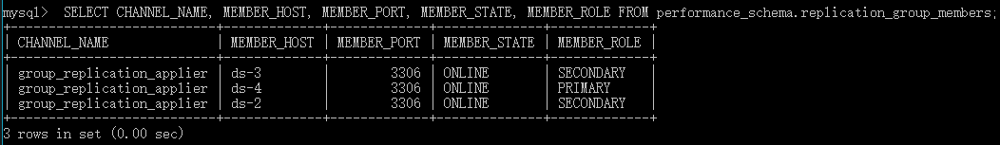

# MySQL 集群

## 任务
- 使用[MySQL Group Replication](https://dev.mysql.com/doc/refman/8.0/en/group-replication.html)在三台服务器上搭建高可用的数据库集群，每个服务器上有一个数据库实例运行。

## 步骤
### MySQL Group Replication
1. 在ds-2、ds-3、ds-4上安装MySQL。
   ```shell
   wget https://dev.mysql.com/get/mysql-apt-config_0.8.13-1_all.deb
   sudo dpkg -i mysql-apt-config_0.8.13-1_all.deb
   sudo apt update
   sudo apt install mysql-server
   ```
   选择8.0版本，并设置root密码。

2. 编写配置文件`mgr.cnf`并拷贝到ds-2、ds-3、ds-4的`/etc/mysql/mysql.conf.d/`中。
   ```conf
   [mysqld]
   
   # common configures
   disabled_storage_engines="MyISAM,BLACKHOLE,FEDERATED,ARCHIVE,MEMORY"
   gtid_mode=ON
   enforce_gtid_consistency=ON
   binlog_checksum=NONE
   log_bin=binlog
   log_slave_updates=ON
   binlog_format=ROW
   master_info_repository=TABLE
   relay_log_info_repository=TABLE
   
   # group replication configures
   transaction_write_set_extraction=XXHASH64
   group_replication_group_name="xxxxxxxx-xxxx-xxxx-xxxx-xxxxxxxxxxxx"
   group_replication_group_seeds="ds-4:{port},ds-3:{port},ds-2:{port}"
   group_replication_start_on_boot=off
   group_replication_bootstrap_group=off
   
   # specifics about each instance
   server_id={N}
   bind-address=ds-{N}
   report_host=ds-{N}
   group_replication_local_address="ds-{N}:{port}"
   relay_log=ds-{N}-relay-bin
   ```
   根据服务器的host name，将`{N}`替换为相应的数字。

   - transaction_write_set_extraction

      Group Replication必须使用*XXHASH64*加密算法。

   - group_replication_group_name

      指示服务器加入的是哪个Group。同一个Group中的所有服务器应当配置相同的Group Name。
      我们使用Python的UUID库生成了使用的Group Name。
      ```python
      >>> import uuid
      >>> uuid.uuid4()
      UUID('xxxxxxxx-xxxx-xxxx-xxxx-xxxxxxxxxxxx')
      ```

   - group_replication_group_seeds

      指示Group中所有服务器的hostname和port，这里的hostname必须在各台服务器上均能被解析。

   - group_replication_start_on_boot

      指示mysqld是否在启动的时候加入Group Replication。我们决定每次手动加入Group Replication，因此设置为off。

   - group_replication_bootstrap_group

      指示mysqld是否在启动的时候启动Group Replication。一个Group只能由一台服务器启动，且运行期间不能被再次启动，否则会发生*裂脑现象(split-brain)*。因此我们在后续过程中手动启动Group。

3. 分别在ds-2、ds-3、ds-4上登录本地MySQL服务器
   ```shell
   $ mysql -u root -p
   ```

   然后安装Group Replication插件。
   
   ```sql
   mysql> INSTALL PLUGIN group_replication SONAME 'group_replication.so';
   ```

4. 重启各个mysql服务器，应用新的配置文件。
   ```shell
   $ sudo service mysql restart
   ```

5. 在Primary服务器上创建一个新的、具有Group Replication权限的账户。
   ```sql
   mysql> CREATE USER '{mgr-user}'@'%' IDENTIFIED BY '{password}';
   mysql> GRANT REPLICATION SLAVE ON *.* TO '{mgr-user}'@'%';
   mysql> FLUSH PRIVILEGES;
   ```

   接着，在每台服务器上执行如下命令，设置连接Master的账户为新创建的账户。

   ```sql
   mysql> CHANGE MASTER TO MASTER_USER='{mgr-user}', MASTER_PASSWORD='{password}' FOR CHANNEL 'group_replication_recovery';
   ```

6. 在Primary上启动并加入Group Replication。
   ```sql
   mysql> SET GLOBAL group_replication_bootstrap_group=ON;
   mysql> START GROUP_REPLICATION;
   mysql> SET GLOBAL group_replication_bootstrap_group=OFF;
   ```

7. 让各个Secondary加入Group Replication。
   ```sql
   mysql> START GROUP_REPLICATION;
   ```

8. 过一段时间，在所有服务器的MySQL中执行
   ```sql
   mysql> SELECT * FROM performance_schema.replication_group_members;
   ```
   应当可以看到我们的三台服务器都成功上线。

   

