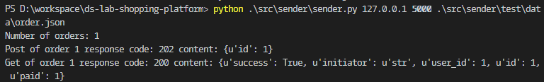
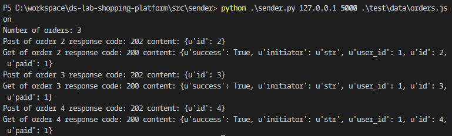

# Sender

## 使用方法
以如下命令运行[`sender.py`](./sender.py)向对应地址发送订单。（请使用python2）
```shell
$ # 先进入src/sender文件夹。
$ python sender.py {host} {port} {file name}
$ # Example
$ python sender.py 127.0.0.1 5000 test/data/orders.json
```
[`order.json`](./order.json)文件内有一个对象，[`orders.json`](./orders.json)文件则有一个数组。`sender.py`可以判断文件内容并发送正确消息。

### 在本地测试Sender

1. 运行[`receiver.py`](./receiver.py)模拟服务器。receiver每就收一个order信息会将order_id加1，使得返回的order_id从1开始依次增加。
   ```shell
   $ python test/receiver.py # 运行在端口http://127.0.0.1:5000
   ```

2. 运行`sender.py`，输入的数据文件为`order.json`。
   ```shell
   $ python sender.py 127.0.0.1 5000 test/data/order.json
   ```
   

3. 运行`sender.py`，输入的数据文件为`orders.json`。
   ```shell
   $ python sender.py 127.0.0.1 5000 test/data/order.json
   ```
   

## 接口
### Input
- Example of order (from file as json)
```json
{
  "user_id": 123456,
  "initiator": "RMB",
  "time": 1558868400000,
  "items": [
    {"id": "1", "number": 2},
    {"id": "3", "number": 1}
  ]
}
```
- Host (from sys.args)
- Port (from sys.args)

### Internel call
#### POST Request
- POST `http://{host}:{port}/order`
- Content-type: `application/json`
- order from input as request body
#### POST Response
- 202 `{"id": "str"}` 请求成功
- 4xx `{"error": "str", "details": ["line1", "line2", ...]}` 请求出错
- 5xx 服务出错
#### GET Request
- GET `http://{host}:{port}/order/{id}`
#### GET Response
- 200 `{"id": "str", "user_id": int, "initiator": "str", "success": null/true/false, "paid": float}` null表示还在处理中

### Output
- Result (to screen)
